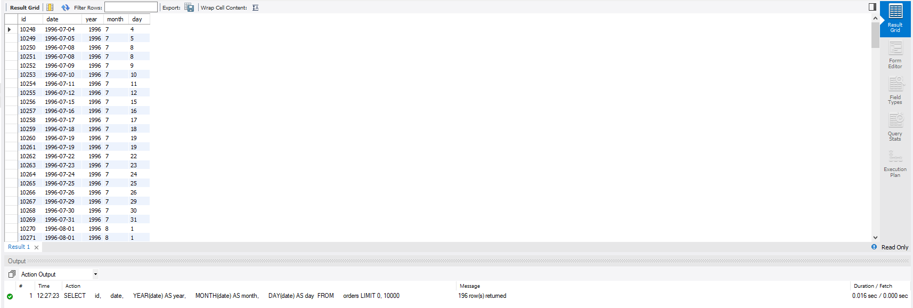
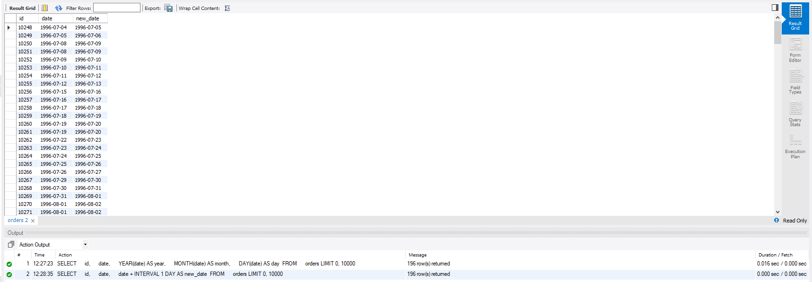
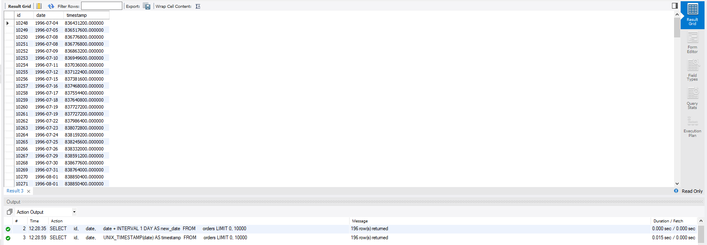
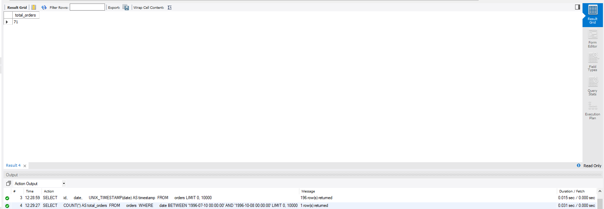
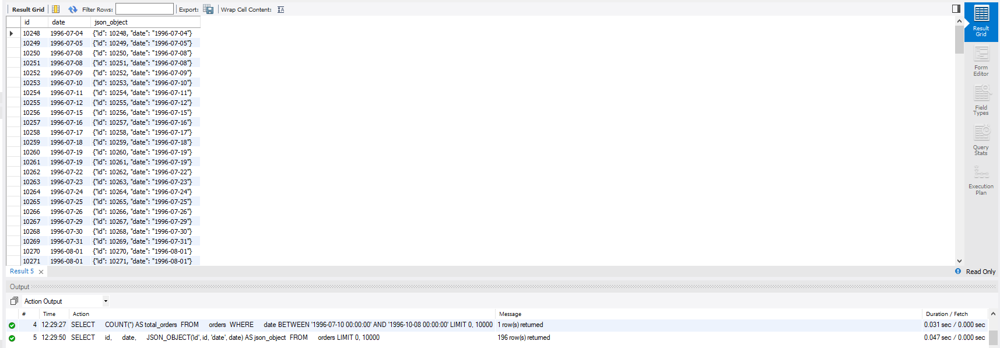

# Домашнє завдання до Теми 7. Додаткові вбудовані SQL функції. Робота з часом


## 1. Витягнення року, місяця та дня з атрибута date:

```sql
SELECT 
    id, 
    date, 
    YEAR(date) AS year, 
    MONTH(date) AS month, 
    DAY(date) AS day 
FROM 
    orders;

```



## 2. Додавання одного дня до атрибута date:

```sql
SELECT 
    id, 
    date, 
    date + INTERVAL 1 DAY AS new_date 
FROM 
    orders;
```



## 3. Перетворення date на кількість секунд з початку Unix Epoch:

```sql
SELECT 
    id, 
    date, 
    UNIX_TIMESTAMP(date) AS timestamp 
FROM 
    orders;

```

	
## 4. Підрахунок рядків у межах певного інтервалу дат:

```sql
SELECT 
    COUNT(*) AS total_orders 
FROM 
    orders 
WHERE 
    date BETWEEN '1996-07-10 00:00:00' AND '1996-10-08 00:00:00';
```


## 5. Створення JSON-об’єкта з атрибутами id та date:

```sql
SELECT 
    id, 
    date, 
    JSON_OBJECT('id', id, 'date', date) AS json_object 
FROM 
    orders;
```

